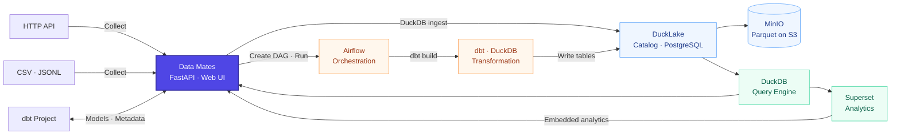

<div align="center">

# 🤝 Data Mates

**흩어진 데이터 작업을 하나의 흐름으로 연결하는 구축형 데이터 플랫폼**

데이터가 들어오는 순간부터 분석에 쓰이는 순간까지, 하나의 환경에서 탐색하고 운영합니다.


</div>


## ✨ Overview

데이터를 운영하려면 수집 설정, 모델 SQL, 계보, 파이프라인 상태, 품질 결과와 대시보드를 서로 다른 도구에서 확인해야 합니다. 하나의 문제를 추적하는 데에도 여러 화면과 파일을 오가며 맥락을 다시 맞춰야 합니다.

Data Mates는 기존 dbt 프로젝트와 실행 환경을 그대로 연결해 **수집 → 모델링 → 실행 → 품질 → 분석**을 하나의 흐름으로 보여줍니다. 데이터의 출처와 변환 과정, 실패 지점, 변경 영향 범위와 실제 활용 현황을 한곳에서 탐색하고 운영하는 것이 목표입니다.

## 🧩 Key Features

<table>
  <tr>
    <td width="50%" valign="top">
      <h3>01 · 📥 Collect</h3>
      HTTP API와 CSV·JSON Lines 데이터를 미리 확인한 뒤 원천 데이터로 등록합니다. 수동 실행과 예약 실행을 지원합니다.
    </td>
    <td width="50%" valign="top">
      <h3>02 · 🧱 Model</h3>
      기존 dbt 프로젝트의 SQL, 설명, 컬럼과 테스트를 기반으로 데이터 모델을 탐색하고 편집합니다.
    </td>
  </tr>
  <tr>
    <td width="50%" valign="top">
      <h3>03 · 🕸️ Lineage</h3>
      모델과 컬럼의 상·하류 경로를 추적해 데이터가 만들어지는 과정과 변경 영향 범위를 확인합니다.
    </td>
    <td width="50%" valign="top">
      <h3>04 · ⚙️ Pipeline</h3>
      모델 의존성에 맞춰 실행 순서를 구성하고, 수동·예약·이벤트 실행과 실패 지점부터의 재실행을 관리합니다.
    </td>
  </tr>
  <tr>
    <td width="50%" valign="top">
      <h3>05 · ✅ Quality</h3>
      필수값, 중복, 허용값, 참조 무결성과 범위 규칙을 검사하고 실제 위반 데이터까지 확인합니다.
    </td>
    <td width="50%" valign="top">
      <h3>06 · 📊 Analytics</h3>
      분석용 데이터 마트, 데이터셋과 대시보드를 탐색하고 원천 데이터부터 분석 자산까지의 연결을 확인합니다.
    </td>
  </tr>
</table>

## 🏗️ Architecture



- **Control plane** — FastAPI와 웹 UI가 dbt 프로젝트, 메타데이터, 계보와 실행 이력을 연결합니다.
- **Execution plane** — Airflow가 실행을 오케스트레이션하고 dbt와 DuckDB가 모델을 변환합니다.
- **Data plane** — DuckLake가 PostgreSQL 카탈로그와 MinIO의 Parquet으로 테이블을 저장하며, DuckDB와 Superset이 조회와 분석을 담당합니다.

변환·조회·적재가 모두 같은 DuckDB 엔진을 씁니다. Iceberg + Spark에서 옮겨 온 배경과 검증 결과는 [DuckLake 이관 기록](docs/2026-08-14-ducklake-migration.md)에 정리했습니다.

## 🔄 Data Flow

<p align="center">
  <strong>🗂️ Source</strong><br/>
  <sub>HTTP API · CSV · JSONL</sub><br/>
  ↓<br/>
  <strong>📥 Collect</strong><br/>
  <sub>원천 확인 · 수동/예약 적재</sub><br/>
  ↓<br/>
  <strong>🧱 Model</strong><br/>
  <sub>SQL 변환 · 모델 정의 · 메타데이터</sub><br/>
  ↓<br/>
  <strong>⚙️ Pipeline</strong><br/>
  <sub>의존성 기반 실행 · 상태 · 재실행</sub><br/>
  ↓<br/>
  <strong>✅ Quality</strong><br/>
  <sub>테스트 · 실패 원인 · 위반 데이터</sub><br/>
  ↓<br/>
  <strong>📊 Analytics</strong><br/>
  <sub>데이터 마트 · 데이터셋 · 대시보드</sub>
</p>

모델과 컬럼의 계보는 이 흐름 전체를 연결해 데이터의 출처와 변환 과정, 하류 분석 자산까지 추적합니다.

## 🛠️ Tech Stack

| Area | Technologies |
| --- | --- |
| Application |    |
| Modeling & Compute |   |
| Orchestration |  |
| Lakehouse |    |
| Analytics |  |
| Infrastructure |    |

## 🚀 Getting Started

### Prerequisites

- Python 3.11
- Docker 환경(Docker Desktop 또는 Colima)
- 연결할 dbt 프로젝트
- Java 17은 Spark 롤백 타깃(`DBT_TARGET=spark_local`)을 쓸 때만 필요합니다

### Run

```bash
# 1. 사용할 dbt 프로젝트 연결
export DBT_PROJECT_DIR=/absolute/path/to/your-dbt-project

# 2. 카탈로그 볼륨 준비
docker volume create iceberg-catalog

# 3. 분석 환경을 포함한 전체 스택 실행
docker-compose -f docker-compose.yml -f docker-compose.superset.yml up -d

# 4. Iceberg 카탈로그 초기화
./scripts/bootstrap_catalog.sh
```

### 🐳 Container Image

[](https://hub.docker.com/r/zisu17/datamates)

Data Mates는 애플리케이션, Airflow, Superset을 하나의 이미지로 배포합니다. 각 컨테이너는 같은 이미지를 서로 다른 명령으로 실행하며, Docker Compose가 이미지를 자동으로 내려받습니다.

| 계층 | 구성 |
| --- | --- |
| Application | FastAPI · 웹 UI · DuckDB · psycopg · sqlglot |
| Orchestration | Apache Airflow 3.2.2 |
| Transformation | dbt Core 1.12.0 · dbt-duckdb 1.11.0 · DuckDB 1.5.5 · Elementary |
| Analytics | Apache Superset 5.0.0 · duckdb-engine |

MinIO, PostgreSQL, Redis는 공식 이미지를 사용하고, Iceberg REST 카탈로그만 PostgreSQL JDBC 드라이버를 더해 로컬에서 빌드합니다(`docker/iceberg-rest`). 현재 Data Mates 이미지는 **linux/arm64**만 지원하며, 직접 빌드하는 방법은 [SETUP.md](docs/SETUP.md)를 참고하세요.

## 🎯 Current Scope

Data Mates는 현재 **단일 사용자·소규모 구축형 환경**을 기준으로 개발하고 있습니다.

- 인증, 역할 기반 권한 관리와 조직·사용자별 데이터 격리는 현재 지원하지 않습니다.
- 수집 단계에서는 원본 보존을 위해 값을 문자열로 저장하고, 타입 변환은 모델링 단계에서 수행합니다.
- 메타데이터 저장소와 실행 환경은 개인 또는 소규모 데이터 팀의 로컬 구축을 기준으로 구성합니다.
- 다중 사용자 협업과 대규모 분산 운영은 향후 확장 범위입니다.
