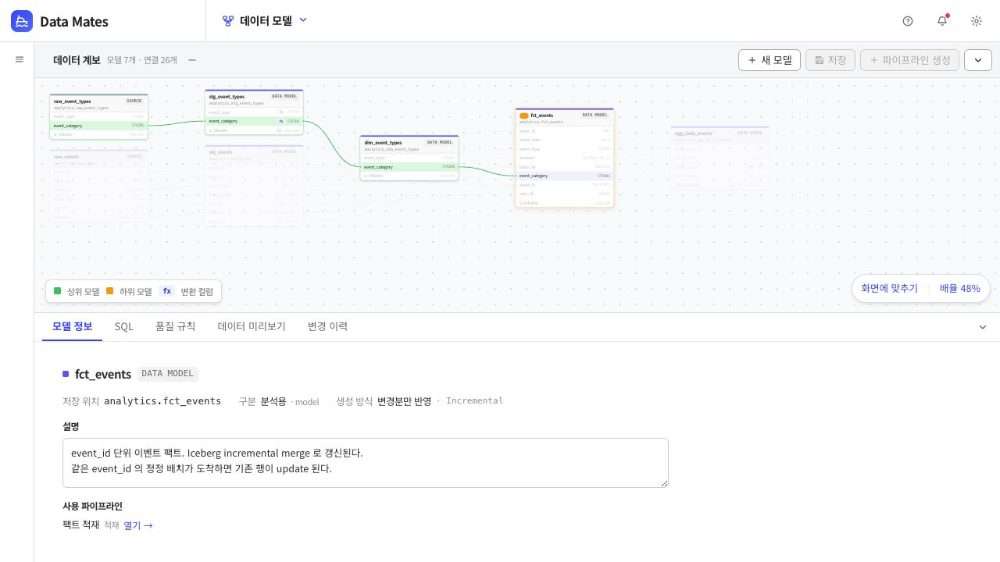

# Data Mates

> 흩어진 데이터 작업을 하나의 흐름으로 연결하는 설치형 데이터 플랫폼

Data Mates는 데이터 수집부터 모델링, 계보, 파이프라인, 품질, 분석까지 한곳에서 관리할 수 있는 데이터 워크스페이스입니다.

데이터가 어디에서 왔는지, 어떤 과정을 거쳐 만들어졌는지, 지금 정상적으로 실행되고 있는지 확인하기 위해 여러 도구와 파일을 오갈 필요가 없습니다. Data Mates는 기존 데이터 프로젝트를 그대로 유지하면서 그 위에 탐색과 운영을 위한 시각적 인터페이스를 제공합니다.


## 해결하려는 문제

데이터를 운영하다 보면 간단한 질문에도 여러 도구를 확인해야 합니다.

- 이 데이터는 어디에서 왔고 어떤 모델을 거쳤는가?
- 컬럼 값은 원본의 어떤 필드에서 계산됐는가?
- 이 모델을 바꾸면 어떤 데이터와 리포트가 영향을 받는가?
- 어떤 파이프라인이 실패했고 어디부터 다시 실행해야 하는가?
- 최근 품질 검사를 통과하지 못한 데이터는 무엇인가?
- 분석에 사용할 수 있도록 준비된 데이터는 무엇인가?

Data Mates는 이 질문들을 하나의 연결된 맥락 안에서 답할 수 있게 합니다.

## 하나로 이어지는 데이터 흐름

```text
데이터 수집 → 데이터 모델 → 데이터 계보 → 데이터 마트
           → 파이프라인 실행 → 품질 확인 → 데이터 분석
```

각 화면은 독립된 관리 메뉴가 아니라 같은 데이터의 다음 단계입니다. 원천 데이터를 등록하면 모델과 계보에 연결되고, 실행 결과는 품질과 이력에 반영되며, 준비된 데이터 마트는 분석 화면에서 바로 사용할 수 있습니다.

## 주요 기능

### 데이터 수집

HTTP API와 CSV·JSON Lines 파일을 미리 확인한 뒤 원천 데이터로 등록합니다. 수동 실행과 예약 실행을 지원하며, 적재가 완료되면 이후 모델링 흐름에서 바로 사용할 수 있습니다.

### 데이터 모델과 카탈로그

조직의 데이터 모델을 검색하고 설명, 컬럼, 저장 위치, 사용 현황을 확인합니다. SQL과 메타데이터를 화면에서 편집할 수 있으며 변경 내용은 원래 프로젝트 파일에 반영됩니다.

### 모델·컬럼 계보

모델 사이의 상하류 관계뿐 아니라 컬럼 하나가 어떤 원본 컬럼과 변환식을 거쳐 만들어졌는지 추적합니다. 특정 컬럼을 선택하면 관련 경로만 강조해 변경 영향 범위를 빠르게 파악할 수 있습니다.



### 데이터 마트

분석과 리포팅에 제공할 모델을 데이터 마트로 지정합니다. 운영 중인 모델과 실제 분석 자산 사이의 연결을 한곳에서 확인할 수 있습니다.

### 데이터 파이프라인

모델의 실제 의존 관계를 바탕으로 실행 순서를 구성합니다. 수동·예약·선행 파이프라인 완료·데이터 갱신 이벤트 실행을 지원하며, 실패 지점과 하류 작업만 선택해 다시 실행할 수 있습니다.

### 데이터 품질

필수값, 중복, 허용값, 참조 무결성, 범위 등 품질 규칙과 최근 검사 결과를 함께 보여줍니다. 실패 데이터가 저장된 규칙은 실제 위반 행까지 확인하고 내보낼 수 있습니다.

### 데이터 분석

준비된 데이터셋과 대시보드를 탐색하고 Data Mates 안에서 분석 결과를 확인합니다. 모델에서 분석 자산으로 이어지는 사용 관계도 함께 추적합니다.

### 실행·변경 이력

파이프라인 실행 결과, 모델별 소요 시간, 실패와 품질 추이, 모델 변경 이력을 기록합니다. 현재 상태만 보여주는 것이 아니라 언제 무엇이 달라졌는지 확인할 수 있습니다.

## 제품 원칙

### 기존 데이터 프로젝트를 그대로 사용합니다

Data Mates를 사용하기 위해 모델을 별도 형식으로 다시 등록할 필요가 없습니다. 기존 프로젝트의 SQL, 설명, 컬럼 정의, 테스트를 읽고 수정하므로 화면과 코드가 서로 다른 정의를 갖지 않습니다.

### 데이터 관계와 실행 관계를 구분합니다

데이터가 만들어지는 순서는 모델의 참조 관계에서 결정하고, 작업이 시작되는 시점은 파이프라인 설정에서 관리합니다. 두 관계를 섞지 않아 모델 변경과 운영 스케줄 변경의 책임이 분명합니다.

### 알 수 없는 관계를 추측하지 않습니다

해석할 수 없는 SQL이나 템플릿은 임의의 계보를 만들지 않고 확인 불가 상태로 표시합니다. 보기 좋은 그래프보다 신뢰할 수 있는 정보를 우선합니다.

### 생성 정보는 다시 만들 수 있어야 합니다

실행 정의와 화면용 메타데이터는 원본 프로젝트와 설정에서 다시 생성할 수 있도록 설계합니다. 사람이 직접 관리해야 하는 중복 정보를 최소화합니다.

## 누구를 위한 제품인가

- 모델 정의와 실행 흐름을 함께 관리하는 데이터 엔지니어
- 컬럼 단위 영향 범위와 품질 결과가 필요한 애널리틱스 엔지니어
- 분석 가능한 데이터가 어떻게 만들어졌는지 확인하려는 데이터 분석가
- 여러 데이터 도구의 상태를 하나의 흐름으로 보고 싶은 소규모 데이터 팀

## 현재 범위

Data Mates는 현재 단일 사용자 설치형 환경을 대상으로 개발하고 있습니다.

- 인증, 역할별 권한, 조직별 데이터 격리는 아직 제공하지 않습니다.
- 수집 단계에서는 원본 보존을 위해 값을 문자열로 저장하며 타입 변환은 모델링 단계에서 수행합니다.
- 메타데이터 저장소와 실행 환경은 소규모 설치를 전제로 구성되어 있습니다.
- 운영 환경 확장과 다중 사용자 협업은 향후 범위입니다.

## 설치와 개발

환경 구성, 실행 방법, 데이터 프로젝트 연결, 문제 해결은 [SETUP.md](SETUP.md)를 참고하세요.

주요 디렉터리의 역할은 다음과 같습니다.

```text
datamates/app/   제품 API와 서비스 연동
ui/              웹 인터페이스
dags/            실행 워크플로
docker/          실행 환경 이미지
scripts/         설치·운영 보조 스크립트
```

Data Mates는 FastAPI 기반 API와 빌드 과정 없는 웹 UI로 구성되며, 기존 데이터 프로젝트와 실행·저장·분석 도구를 연결하는 역할을 합니다.
