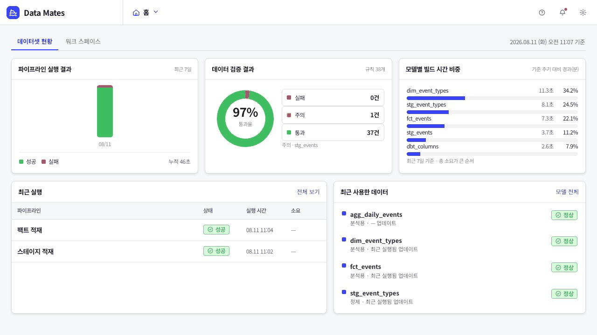
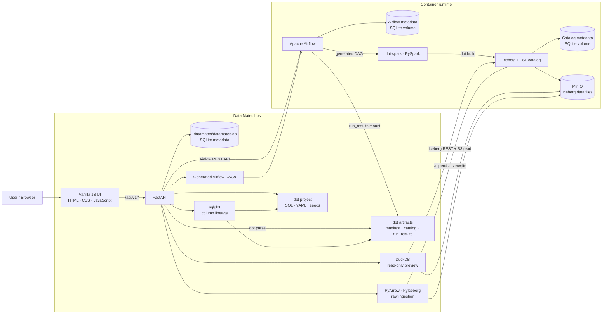
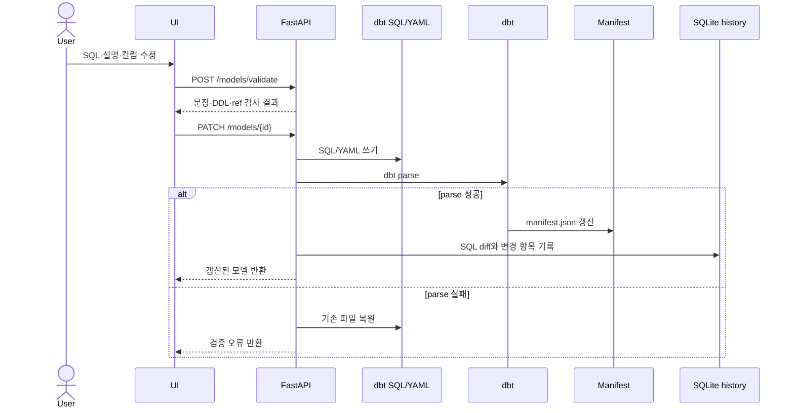
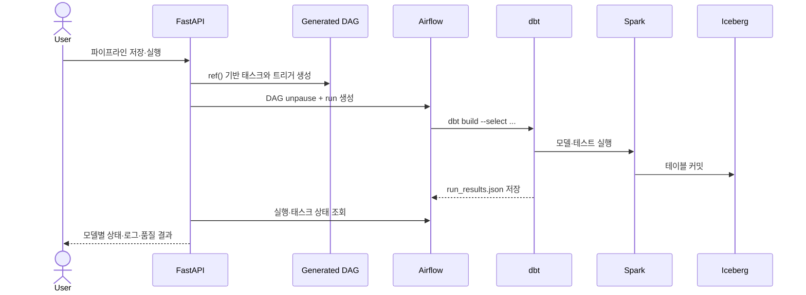
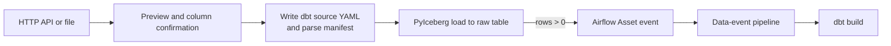

# Data Mates

> dbt 프로젝트를 데이터 수집, 모델 계보, 파이프라인 실행, 품질 관리 화면으로 연결하는 설치형 데이터 플랫폼 콘솔

Data Mates는 **dbt 프로젝트를 단일 진실 원천(SSoT)으로 사용하는 로컬 데이터 플랫폼**입니다. SQL 모델과 `schema.yml`은 계속 Git에서 관리하고, 화면은 그 파일과 dbt 산출물을 읽어 카탈로그·컬럼 계보·품질 상태로 보여줍니다. 모델을 화면에서 수정하면 다시 dbt 파일에 기록되므로, UI와 코드가 서로 다른 정의를 갖지 않습니다.

실행은 Apache Airflow가 맡습니다. Data Mates가 파이프라인 설정을 Airflow DAG로 생성하고, DAG가 dbt와 Spark를 실행해 Apache Iceberg 테이블을 MinIO에 저장합니다. API·파일 수집 데이터도 같은 Iceberg 카탈로그에 원천 테이블로 등록되어 이후 dbt 모델과 계보에 이어집니다.

현재 구현은 **인증과 멀티 테넌시가 없는 단일 사용자 설치형 환경**을 전제로 합니다. 주요 사용자는 dbt 모델을 작성하고 실행 흐름과 데이터 품질을 함께 관리하려는 데이터 엔지니어·애널리틱스 엔지니어입니다.

## Why — 왜 만들었는가

dbt 프로젝트에서 모델 정의는 SQL 파일에, 의존성은 `ref()`에, 품질 규칙은 YAML과 테스트에 흩어져 있습니다. Airflow를 함께 사용하면 실행 상태와 스케줄은 또 다른 화면에서 확인해야 합니다. 결국 다음 질문에 답하려면 여러 파일과 도구를 오가게 됩니다.

- 이 테이블은 어떤 원천과 모델을 거쳐 만들어졌는가?
- 특정 컬럼은 어디에서 왔고 어떤 식으로 계산됐는가?
- 이 모델을 수정하면 어떤 하류 모델이 영향을 받는가?
- 어떤 파이프라인이 이 모델을 적재하며, 실패한 단계는 어디인가?
- 최근 실행에서 어떤 dbt 테스트가 실패했는가?

Data Mates는 이 정보를 별도 정의로 복제하지 않습니다. **모델 관계는 dbt manifest에서 읽고, 컬럼 관계는 실제 모델 SQL을 분석하며, 실행 상태는 Airflow와 `run_results.json`에서 가져옵니다.** dbt가 알지 못하는 파이프라인 설정·폴더 배치·변경 이력만 별도 SQLite 메타스토어에 저장합니다.

이 구조에서 데이터 의존성과 실행 의존성은 분리됩니다.

```text
Task Dependencies      모델 ↔ 모델      SQL의 ref()로 결정      화면에서 직접 수정하지 않음
Pipeline Dependencies  파이프 ↔ 파이프  실행 트리거 관계         화면에서 연결·해제
```

모델 관계를 바꾸려면 SQL을 수정하고, 실행 시점을 바꾸려면 파이프라인 트리거를 수정합니다. 두 관계를 한 그래프에 섞지 않아 데이터가 만들어지는 방식과 작업이 시작되는 조건을 구분할 수 있습니다.

## 실제 사용자 흐름



로컬 스택에서 스테이지와 팩트 파이프라인을 여러 차례 실행한 실제 흐름입니다. 홈의 실행·빌드 시간 통계를 확인하고, 모델에서 `fct_events.event_category`의 입력 컬럼을 추적한 뒤, 성공한 파이프라인과 dbt 품질 결과를 확인합니다. 현재 개발 데이터에는 품질 규칙 38개 중 통과 37개와 주의 1개가 있습니다.

## 핵심 기능

### 데이터 수집과 dbt Source 연결

외부 데이터를 모델링하려면 먼저 재현 가능한 원천 테이블이 필요합니다. Data Mates는 HTTP `GET`·`POST` 응답과 CSV·JSON Lines 파일을 미리보기하고, 확인한 컬럼을 Apache Arrow 테이블로 변환해 PyIceberg로 `raw.<table>`에 적재합니다.

사용자는 덧붙이기와 전체 교체 중 적재 방식을 선택할 수 있습니다. API 수집은 수동 또는 예약 DAG로 실행하고, 파일은 업로드 시 바로 적재합니다. 작업을 저장하면 dbt source YAML과 manifest가 함께 갱신되어 새 원천이 카탈로그와 계보에 나타납니다. 같은 원천 테이블에는 수집 작업 하나만 쓰도록 서버에서 충돌을 막습니다.

### SQL 모델 관리와 컬럼 단위 계보

모델 정의와 화면의 관계 정보가 따로 관리되면 시간이 지나면서 둘이 어긋납니다. Data Mates에서는 모델 하나를 SQL 하나로 정의하고, 저장 시 `.sql`·`schema.yml`을 쓴 뒤 `dbt parse`가 성공해야 변경을 확정합니다. 여러 SQL 문장, DDL·DML, 존재하지 않는 `ref()`는 저장 전에 검사합니다.

모델 단위 의존성은 dbt manifest를 그대로 사용합니다. 컬럼 계보는 sqlglot으로 Spark SQL AST를 분석하여 CTE, 조인, `select *`, 함수, `CASE`, 윈도 함수와 N:1 변환의 입력 컬럼을 추적합니다. 해석할 수 없는 Jinja나 SQL은 추측하지 않고 `계보 확인 불가`로 표시합니다.

아래 화면은 `fct_events.event_category`를 직접 선택한 결과입니다. `raw_event_types.event_category`에서 `stg_event_types`, `dim_event_types`를 거쳐 팩트 컬럼으로 이어지는 경로만 강조됩니다.


### dbt 의존성을 보존하는 파이프라인

파이프라인 화면에서 모델 순서를 다시 정의하면 SQL의 실제 의존성과 실행 순서가 달라질 수 있습니다. Data Mates는 선택한 대상 모델의 상류를 `ref()` 관계로 확장하고 위상 정렬하여 Airflow 태스크 의존성으로 옮깁니다.

사용자는 예약, 수동, 선행 파이프라인 완료 후, 입력 데이터 갱신 이벤트 중 실행 방식을 선택할 수 있습니다. 한 모델의 적재 소유권은 파이프라인 하나에만 주고, 다른 파이프라인에서 필요한 모델은 조회 전용 입력으로 취급합니다. 부분 재실행은 선택한 실패 지점과 그 하류 Airflow 태스크를 다시 큐에 넣습니다.

### dbt 테스트 기반 품질 관리

품질 상태를 별도 규칙 DB에서 계산하면 실제 dbt 빌드 결과와 달라질 수 있습니다. Data Mates는 manifest의 테스트 정의와 최근 `run_results.json`을 결합해 규칙 상태를 계산합니다.

필수값, 중복, 허용값, 참조 무결성, 범위, 최신성, 사용자 정의 SQL 테스트를 한 목록에서 조회합니다. 화면에서 새로 만들 수 있는 것은 필수값·중복·허용값·참조 무결성·범위 규칙이며, 심각도와 사용 여부도 YAML에 반영할 수 있습니다. 최신성은 dbt source 설정으로, 사용자 정의 SQL은 `tests/` 파일로 관리합니다. 실패 행이 저장된 테스트는 Iceberg 테이블을 DuckDB로 조회해 위반 데이터를 보여주며, 결과는 CSV로 내려받을 수 있습니다.

### 빠른 미리보기와 변경 이력

`dbt show`는 로컬 Spark 세션과 Iceberg 런타임을 매번 시작하므로 화면 미리보기에 적합하지 않습니다. Data Mates는 조회 전용 경로에서 DuckDB의 Iceberg 확장으로 REST 카탈로그와 MinIO를 직접 읽습니다. 테이블 생성과 변경은 계속 dbt·Spark만 담당합니다.

모델을 저장할 때는 SQL diff, 설명, materialization, 컬럼 정의, 태그, 입력 `ref()` 변화와 품질 규칙 변경을 SQLite에 기록합니다. 사람의 조회 이력은 수집하지 않으며, 사용 현황에는 확인 가능한 파이프라인 실행 기록만 표시합니다.

## Service Architecture



요청과 데이터는 다음 순서로 이동합니다.

1. FastAPI가 정적 UI와 `/api/v1` API를 같은 포트에서 제공합니다.
2. 화면 부팅 시 `/api/v1/bootstrap`이 dbt manifest, SQLite 메타데이터, Airflow 상태와 최근 dbt 결과를 한 번에 조합합니다.
3. 모델 저장 요청은 dbt 파일을 수정하고 `dbt parse`로 검증한 뒤 manifest 캐시를 갱신합니다.
4. 파이프라인 저장 요청은 `dags/datamates_<id>.py`를 생성합니다. Airflow가 이 DAG에서 컨테이너 내부 dbt를 실행합니다.
5. dbt-spark는 Iceberg REST 카탈로그를 통해 MinIO의 Iceberg 테이블을 읽고 씁니다.
6. 미리보기·통계는 Spark를 시작하지 않고 DuckDB가 같은 카탈로그와 오브젝트 스토리지를 읽습니다.

### 데이터별 진실 원천

| 데이터 | 진실 원천 | Data Mates의 역할 |
| --- | --- | --- |
| 모델 SQL·설명·컬럼·태그·품질 규칙 | `dbt/models`, `dbt/seeds`, YAML | 읽기, 파일 수정, `dbt parse` |
| 모델·컬럼 의존성 | dbt manifest + 모델 SQL | manifest 조회, sqlglot 분석 |
| 파이프라인·수집 작업·폴더·변경 이력 | `.datamates/datamates.db` | SQLite 저장 |
| 실행·일시정지·다음 실행 시각 | Airflow | REST API 조회·제어 |
| 모델별 실행 결과 | dbt `run_results.json` | Airflow 태스크 상태와 결합 |
| 테이블 데이터 | MinIO의 Iceberg 파일 | dbt/PyIceberg 쓰기, DuckDB 읽기 |

## 주요 처리 흐름

### 모델을 저장할 때



### 파이프라인을 실행할 때



Iceberg REST fixture의 카탈로그 메타데이터가 SQLite이므로 현재 DAG는 `max_active_tasks=1`이며, 모든 쓰기 작업은 Airflow의 `iceberg_write` 풀 한 슬롯을 공유합니다.

### 수집 데이터가 후행 파이프라인을 깨울 때



API 수집 DAG은 실제 적재를 FastAPI의 `/ingest/jobs/{id}/execute`에 요청하고 성공 시 Asset 이벤트를 발행합니다. 파일 수집은 업로드 요청에서 바로 적재한 뒤 같은 이벤트를 직접 발행합니다. 적재 행이 0이면 이벤트를 만들지 않아 빈 후행 실행이 쌓이지 않습니다.

## 주요 API

FastAPI의 전체 OpenAPI 문서는 실행 후 [http://localhost:8000/docs](http://localhost:8000/docs)에서 확인할 수 있습니다.

| 영역 | 주요 경로 | 역할 |
| --- | --- | --- |
| 상태·부팅 | `GET /api/v1/health`, `GET /api/v1/bootstrap`, `POST /api/v1/reparse` | 연결 상태 확인, 초기 화면 데이터 조합, 외부 dbt 변경 반영 |
| 수집 | `/api/v1/ingest/preview`, `/api/v1/ingest/jobs`, `/runs`, `/upload` | API·파일 미리보기, 작업 저장, 예약·수동 실행, 파일 적재 |
| 카탈로그 | `/api/v1/catalog`, `/catalog/{id}/preview`, `/graph` | 모델 검색, DuckDB 미리보기, 모델 관계 조회 |
| 모델 | `/api/v1/models`, `/models/validate`, `/models/{id}/history` | 모델 생성·수정·삭제, SQL 검사, 변경 이력 |
| 계보 | `GET /api/v1/lineage` | 모델·컬럼 간선과 변환식 조회 |
| 파이프라인 | `/api/v1/pipelines`, `/pipelines/{id}/runs`, `/pipelines/flow` | DAG 설정, 실행·부분 재실행, 파이프라인 간 의존성 |
| 품질 | `/api/v1/quality/rules`, `/quality/dashboard`, `/quality/violations` | dbt 테스트 규칙과 최근 결과, 실패 행 조회 |
| 이력 | `/api/v1/history/*` | dbt 실행 요약, 모델별 성능, 실패·테스트 추이 |

## Tech Stack

실제 코드에서 호출되는 기술만 정리했습니다.

| 영역 | 기술 | 역할 |
| --- | --- | --- |
| Frontend | HTML, CSS, Vanilla JavaScript | 빌드 과정 없는 단일 페이지 UI, FastAPI 정적 파일로 제공 |
| Backend | Python 3.11, FastAPI 0.121.2, Uvicorn 0.41.0, Pydantic 2.13.3 | REST API, 정적 UI, 입력 검증 |
| Modeling | dbt-core 1.12.0, dbt-spark 1.11.0 | SQL 모델·테스트·manifest 관리 |
| Processing | PySpark 4.0.4, Java 17 | dbt 모델과 품질 테스트 실행 |
| Lineage | sqlglot 30.14.0 | Spark SQL AST 기반 컬럼 계보와 변환식 분석 |
| Orchestration | Apache Airflow 3.2.2 | 생성 DAG 실행, 스케줄, 재시도, Asset 이벤트 |
| Table format | Apache Iceberg 1.10.1 REST fixture | 네임스페이스·테이블·스냅샷 관리 |
| Object storage | MinIO | Iceberg 데이터·메타데이터 파일 저장 |
| Ingestion | PyIceberg 0.11.1, PyArrow 25.0.0 | Spark를 거치지 않는 원천 데이터 적재 |
| Query | DuckDB + Iceberg extension | 미리보기와 이력 통계용 읽기 전용 조회 |
| Metadata | SQLite | Data Mates 상태, Airflow 메타데이터, Iceberg 카탈로그 메타데이터 |
| Quality | dbt tests, dbt-utils, Elementary | 품질 규칙 실행과 결과 테이블 적재 |
| Infrastructure | Docker Compose, Colima | MinIO·Iceberg REST·Airflow 로컬 실행 |

프론트엔드는 React·Vue 같은 프레임워크나 npm 빌드를 사용하지 않습니다. `ui/index.html`이 CSS와 JavaScript 파일을 순서대로 로드하고, 마지막 `ui/js/api.js`가 서버 데이터로 화면 상태를 채웁니다.

## 프로젝트 구조

```text
datamates/
├── datamates/app/          # FastAPI, dbt·Airflow·Iceberg 연동, API 라우터
│   ├── routers/            # 수집·카탈로그·모델·파이프라인·품질·이력 API
│   ├── daggen.py           # 파이프라인 Airflow DAG 생성
│   ├── ingestdag.py        # API 수집 Airflow DAG 생성
│   ├── collineage.py       # sqlglot 컬럼 계보 분석
│   ├── warehouse.py        # DuckDB 기반 Iceberg 읽기
│   └── store.py            # Data Mates SQLite 메타스토어
├── ui/                     # 빌드 없는 HTML·CSS·Vanilla JS 화면
├── dbt/                    # dbt 프로젝트: models, seeds, macros, tests, profiles
├── dags/                   # 수동 DAG와 자동 생성되는 datamates_*.py
├── docker/airflow/         # Java 17과 별도 dbt venv가 포함된 Airflow 이미지
├── scripts/                # Iceberg 네임스페이스 부트스트랩
├── tools/ui-refactor/      # UI 로드 순서·중복 정의·회귀 점검 도구
├── docs/images/            # README 사용자 흐름 GIF와 컬럼 계보 이미지
├── docker-compose.yml      # MinIO, Iceberg REST, Airflow
├── env.sh                  # 호스트 dbt·Spark 환경 설정
├── SETUP.md                # 새 macOS 환경 구축과 문제 해결 상세
└── README.md
```

실행 중에는 Git이 관리하지 않는 상태가 추가됩니다.

```text
.datamates/datamates.db    # 파이프라인·수집·폴더·변경 이력
.datamates/runs/           # Airflow가 실행한 dbt run_results
dbt/target/                # 호스트 dbt manifest·catalog·run_results
dags/datamates_*.py        # 메타스토어에서 재생성되는 DAG
```

## Getting Started

아래는 현재 코드와 [SETUP.md](SETUP.md)에서 검증한 macOS 로컬 실행 절차입니다. Apple Silicon과 Intel 경로는 `env.sh`가 구분합니다.

### 1. 저장소 받기

```bash
git clone https://github.com/zisu17/datamates.git
cd datamates
```

### 2. 필수 도구 설치

```bash
brew install python@3.11 openjdk@17 colima docker docker-compose
```

Spark 4.0은 Java 17 또는 21이 필요합니다. 이 프로젝트는 Java 17, Python 3.11, Colima 6 CPU·8 GiB 환경에서 검증했습니다.

### 3. Python 의존성 설치

```bash
python3.11 -m venv .venv
.venv/bin/pip install --upgrade pip
.venv/bin/pip install -r requirements.txt -r datamates/requirements.txt
```

`warehouse.py`는 미리보기와 이력 조회에 DuckDB를 사용합니다. 현재 requirements 파일에는 DuckDB가 고정되어 있지 않으므로 해당 기능을 사용하려면 설치합니다.

```bash
.venv/bin/pip install duckdb==1.5.5
```

### 4. 컨테이너 스택 실행

```bash
colima start --cpu 6 --memory 8
docker volume create iceberg-catalog
docker-compose up -d
./scripts/bootstrap_catalog.sh
```

`iceberg-catalog`는 `external: true` 볼륨이므로 최초 한 번 직접 만들어야 합니다. Compose는 MinIO의 `warehouse`·`landing` 버킷을 자동 생성하고, 부트스트랩 스크립트는 `analytics`, `analytics_elementary`, `analytics_test_failures` 네임스페이스를 만듭니다.

### 5. dbt 초기화

```bash
source ./env.sh
dbt deps
dbt run --select elementary
dbt build --full-refresh
```

`dbt run --select elementary`는 결과 적재 테이블을 만드는 최초 1회 작업입니다. 현재 샘플 프로젝트의 기준 결과는 `PASS=75 WARN=1 ERROR=0 / TOTAL=76`이며, 경고 1건은 익명 이벤트의 `user_id` null을 허용한 테스트입니다.

### 6. 애플리케이션 실행

```bash
./datamates/run.sh
```

| 서비스 | URL |
| --- | --- |
| Data Mates | [http://localhost:8000](http://localhost:8000) |
| FastAPI OpenAPI | [http://localhost:8000/docs](http://localhost:8000/docs) |
| Airflow | [http://localhost:8080](http://localhost:8080) |
| MinIO Console | [http://localhost:9001](http://localhost:9001) |
| Iceberg REST | [http://localhost:8181/v1/config](http://localhost:8181/v1/config) |

Airflow의 로컬 admin 비밀번호는 컨테이너가 생성합니다.

```bash
docker exec airflow cat /opt/airflow/simple_auth_manager_passwords.json.generated
```

### 7. 연결 확인

```bash
curl -s http://localhost:8000/api/v1/health | python3 -m json.tool
```

정상 상태에서는 `manifest.model_count`와 `manifest.source_count`가 표시되고 `airflowOk`가 `true`입니다.

종료할 때는 다음 명령을 사용합니다. Named volume은 유지되므로 다시 실행하면 데이터와 Airflow 상태가 이어집니다.

```bash
docker-compose down
colima stop
```

## Environment Variables

로컬 실행에 필수인 값은 `env.sh`, `docker-compose.yml`, 코드 기본값으로 제공되므로 `.env` 파일이 없어도 실행할 수 있습니다. 비밀번호 기본값은 로컬 개발용이며 외부 환경에서는 반드시 바꿔야 합니다.

### 공통·로컬 설정

| 변수 | 기본값·설정 위치 | 역할 |
| --- | --- | --- |
| `DATUM_PORT` | `8000` | FastAPI·UI 포트 |
| `DBT_TARGET` | `local` | `local`, `local_heavy`, `remote` dbt 출력 선택 |
| `DBT_SCHEMA` | `analytics` | dbt 대상 스키마 |
| `DBT_PROJECT_DIR` | `env.sh`가 `<repo>/dbt`로 설정 | dbt 프로젝트 위치 |
| `DBT_PROFILES_DIR` | `env.sh`가 `dbt/profiles`로 설정 | dbt 프로필 위치 |
| `ICEBERG_REST_URI` | `http://localhost:8181` | 호스트의 Iceberg REST 주소 |
| `MINIO_ENDPOINT` | `http://localhost:9000` | 호스트의 MinIO S3 API 주소 |
| `MINIO_ROOT_USER` | 로컬 기본값 `minioadmin` | MinIO 접근 키 |
| `MINIO_ROOT_PASSWORD` | 로컬 기본값 `minioadmin` | MinIO 비밀 키. 외부 환경에서는 변경 필요 |
| `AIRFLOW_BASE_URL` | `http://localhost:8080` | FastAPI가 호출하는 Airflow 주소 |
| `AIRFLOW_USER` | `admin` | Airflow Simple Auth 사용자 |
| `AIRFLOW_PASSWORD` | 미설정 시 컨테이너 생성 파일에서 읽음 | Airflow API 비밀번호 |
| `DATAMATES_CONTAINER_API` | `http://host.docker.internal:8000/api/v1` | 수집 DAG가 호출하는 Data Mates API |
| `DBT_SPARK_EVENTLOG` | `<repo>/.spark-events` | Spark 이벤트 로그 위치 |
| `SPARK_EVENTLOG_ENABLED` | `true` (`env.sh`) | Spark 이벤트 로그 기록 여부 |
| `SPARK_DRIVER_MEMORY` | `4g` | `local_heavy` 드라이버 메모리 |

### 원격 Spark Thrift 연결

| 변수 | 기본값 | 역할 |
| --- | --- | --- |
| `SPARK_THRIFT_HOST` | `localhost` | Spark Thrift Server 호스트 |
| `SPARK_THRIFT_PORT` | `10000` | Spark Thrift Server 포트 |
| `SPARK_USER` | 빈 값 | 원격 Spark 사용자 |
| `SPARK_AUTH` | `NOSASL` | Thrift 인증 방식 |
| `DBT_CONNECT_TIMEOUT` | `30` | 연결 제한 시간 |
| `DBT_CONNECT_RETRIES` | `3` | 연결 재시도 횟수 |
| `ICEBERG_CATALOG` | `rest_prod` | 원격 Spark 카탈로그 이름 |
| `ICEBERG_WAREHOUSE` | `hdfs:///warehouse/iceberg` | 원격 웨어하우스 위치 |

실제 secret은 README나 Git에 기록하지 말고 셸 환경 또는 배포 환경의 secret 관리 기능으로 주입합니다.

## 현재 구현 범위와 제약

- 인증·권한·조직별 데이터 격리는 아직 구현되어 있지 않습니다. 공통 헤더를 수신하지만 조회 범위를 나누지는 않습니다.
- Data Mates 메타스토어, Airflow 메타데이터, Iceberg REST fixture 카탈로그는 모두 로컬 SQLite 기반입니다.
- API 수집은 JSON 응답 안의 객체 배열, 파일 수집은 CSV·JSON Lines를 지원합니다. 업로드 파일 한도는 32 MiB입니다.
- 수집 데이터는 원본 보존을 위해 모든 값을 문자열로 적재합니다. 타입 변환은 dbt 모델의 책임입니다.
- 사람의 조회 이력은 수집하지 않습니다. 확인 가능한 파이프라인 실행 이력만 사용 현황에 표시합니다.
- `dags/datamates_*.py`는 생성물이므로 직접 수정하지 않습니다. 서버 기동과 파이프라인 저장 시 메타스토어 기준으로 다시 생성됩니다.

새 머신 설치, 볼륨 이전, Java·Spark 충돌, Colima DNS 등 자세한 문제 해결은 [SETUP.md](SETUP.md)를 참고하세요.
