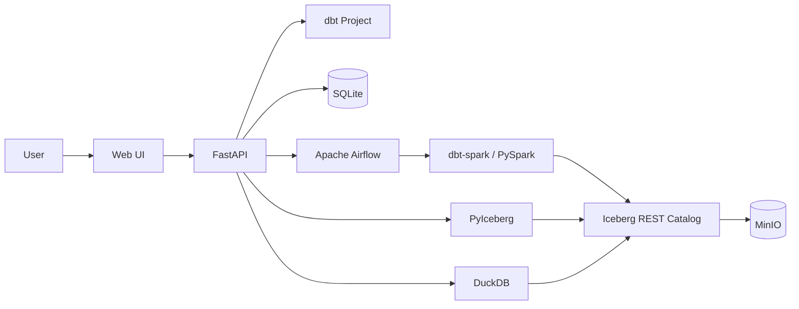

# Data Mates

> dbt 기반 데이터 모델링부터 수집, 계보, 파이프라인 실행, 품질 관리까지 연결하는 로컬 데이터 플랫폼

Data Mates는 dbt 프로젝트를 중심으로 데이터의 정의와 실행 상태를 함께 관리하는 설치형 데이터 플랫폼입니다.

SQL 모델과 `schema.yml`은 기존처럼 Git에서 관리하고, Data Mates는 dbt 산출물과 실행 정보를 활용해 데이터 카탈로그, 컬럼 계보, 파이프라인, 품질 상태를 시각화합니다.

화면에서 수정한 모델 역시 dbt 파일에 반영하여 UI와 코드가 서로 다른 정의를 갖지 않도록 구성했습니다.

## Overview

dbt를 사용하면 데이터 모델과 의존성, 품질 규칙을 코드로 관리할 수 있지만 실제 운영에서는 Airflow, 데이터 저장소, 실행 결과 등 여러 도구를 함께 확인해야 합니다.

Data Mates는 이러한 흐름을 하나의 서비스 안에서 연결하는 것을 목표로 합니다.

```text
데이터 수집
    ↓
데이터 모델링
    ↓
데이터 계보
    ↓
파이프라인 실행
    ↓
데이터 품질
```

모델 간 데이터 의존성은 dbt의 `ref()`와 manifest를 기준으로 관리하고, 실행 스케줄과 파이프라인 간 트리거는 별도의 운영 정보로 관리합니다.

## Demo


## Key Features

### Data Ingestion

- HTTP API, CSV, JSON Lines 데이터 수집
- 데이터 미리보기 및 컬럼 확인
- Apache Iceberg 원천 테이블 적재
- 수집 데이터의 dbt Source 자동 등록
- 수동 및 예약 실행 지원

### Data Modeling

- SQL 기반 dbt 모델 생성 및 수정
- 모델당 하나의 SQL로 정의
- 저장 전 SQL 및 `ref()` 유효성 검사
- 모델 설명, 컬럼, 태그, 품질 규칙 관리
- 변경 내용을 dbt SQL / YAML에 반영

### Data Lineage

- dbt manifest 기반 모델 의존성 시각화
- sqlglot 기반 SQL AST 분석
- 컬럼 단위 계보 추적
- CTE, JOIN, CASE, 함수 및 N:1 변환 분석
- 선택한 컬럼의 상·하류 경로 강조

### Data Pipeline

- dbt 모델 의존성을 기반으로 Airflow DAG 생성
- 의존 관계에 따른 실행 순서 자동 결정
- 수동 / 예약 실행
- 선행 파이프라인 완료 후 실행
- 데이터 적재 이벤트 기반 실행
- 실행 상태 및 실패 단계 확인
- 실패 지점 기준 부분 재실행

### Data Quality

- dbt test 기반 품질 규칙 관리
- 필수값, 중복, 허용값, 참조 무결성, 범위 검증
- 최근 품질 테스트 결과 확인
- 실패 데이터 조회
- 품질 규칙과 dbt YAML 동기화

### Data Preview & History

- DuckDB 기반 Iceberg 데이터 미리보기
- Spark 실행 없이 빠른 조회 지원
- 모델 SQL 및 메타데이터 변경 이력 관리
- 파이프라인 실행 결과 및 품질 이력 조회

## Architecture



Data Mates는 데이터 정의를 별도로 복제하기보다 dbt를 모델 정의의 기준으로 사용합니다.

| 영역 | 기준 정보 |
| --- | --- |
| 모델 SQL / 컬럼 / 품질 규칙 | dbt SQL / YAML |
| 모델 의존성 | dbt manifest |
| 컬럼 계보 | dbt manifest + SQL 분석 |
| 파이프라인 / 수집 설정 | Data Mates Metadata |
| 실행 상태 | Apache Airflow |
| 모델 실행 / 테스트 결과 | dbt `run_results.json` |
| 테이블 데이터 | Apache Iceberg |

## Tech Stack

| 영역 | 기술 |
| --- | --- |
| Backend | Python, FastAPI |
| Modeling | dbt-core, dbt-spark |
| Processing | Apache Spark, PySpark |
| Orchestration | Apache Airflow |
| Table Format | Apache Iceberg |
| Object Storage | MinIO |
| Ingestion | PyArrow, PyIceberg |
| Query | DuckDB |
| Lineage | sqlglot |
| Metadata | SQLite |
| Infrastructure | Docker Compose, Colima |

## Project Structure

```text
datamates/
├── datamates/        # FastAPI Backend
├── ui/               # Web UI
├── dbt/              # dbt Project
├── dags/             # Airflow DAG
├── docker/           # Runtime Images
├── scripts/          # Bootstrap Scripts
├── docs/             # Images / Documents
├── docker-compose.yml
├── env.sh
├── SETUP.md
└── README.md
```

## Getting Started

```bash
git clone https://github.com/zisu17/datamates.git
cd datamates
```

Python 환경을 구성합니다.

```bash
python3.11 -m venv .venv
.venv/bin/pip install --upgrade pip
.venv/bin/pip install \
  -r requirements.txt \
  -r datamates/requirements.txt
```

로컬 데이터 플랫폼 스택을 실행합니다.

```bash
colima start --cpu 6 --memory 8
docker volume create iceberg-catalog
docker-compose up -d
./scripts/bootstrap_catalog.sh
```

dbt 프로젝트를 초기화합니다.

```bash
source ./env.sh
dbt deps
dbt run --select elementary
dbt build --full-refresh
```

Data Mates를 실행합니다.

```bash
./datamates/run.sh
```

실행 후 아래 주소에서 확인할 수 있습니다.

- Data Mates: [http://localhost:8000](http://localhost:8000)
- Airflow: [http://localhost:8080](http://localhost:8080)
- MinIO: [http://localhost:9001](http://localhost:9001)

상세한 환경 구성과 문제 해결 방법은 [SETUP.md](SETUP.md)를 참고하세요.

## Current Scope

현재 버전은 단일 사용자 로컬 설치 환경을 대상으로 개발하고 있습니다.

인증, 권한 관리, 멀티테넌시 및 운영 환경용 메타데이터 구성은 향후 확장 영역입니다.
