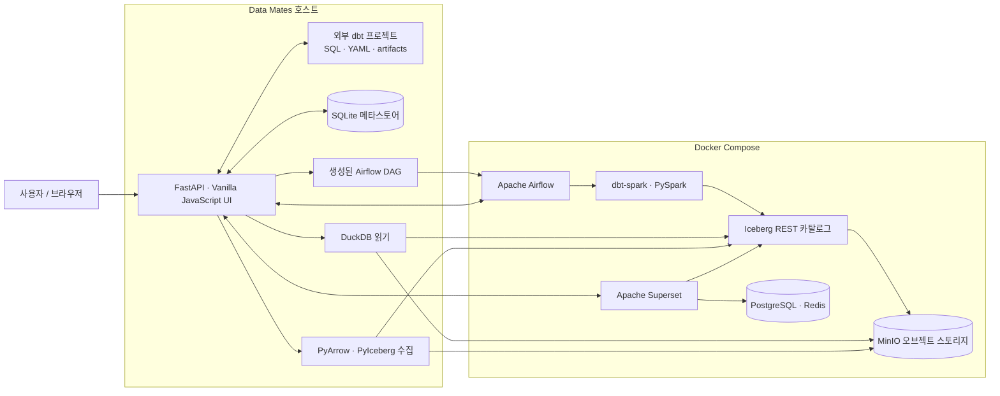

# Data Mates

> dbt 프로젝트를 데이터 수집, 모델·컬럼 계보, 파이프라인 실행, 품질 관리, 분석 화면으로 연결하는 로컬 데이터 플랫폼 콘솔

Data Mates는 dbt 프로젝트를 단일 진실 원천(SSoT)으로 사용하는 설치형 애플리케이션입니다. 모델 SQL, 설명, 컬럼, 의존성, 품질 규칙은 dbt 프로젝트의 Git 저장소에서 계속 관리하고, Data Mates는 dbt 파일과 산출물을 읽어 카탈로그·계보·실행 상태로 보여줍니다.

화면에서 모델이나 품질 규칙을 수정하면 외부 dbt 프로젝트에 다시 기록하고 `dbt parse`로 검증합니다. 실행은 Apache Airflow가, 모델 빌드와 테스트는 dbt·Spark가 담당하며, 결과 테이블은 Apache Iceberg 형식으로 MinIO에 저장합니다. 분석용 모델은 Apache Superset 데이터셋·대시보드로 이어집니다.

> 현재 구현은 인증과 멀티 테넌시가 없는 단일 사용자 로컬 환경을 대상으로 합니다.


## 주요 기능

| 영역 | 할 수 있는 일 |
| --- | --- |
| 데이터 수집 | HTTP `GET`·`POST` 응답과 CSV·JSON Lines 파일을 미리 보고 `raw` Iceberg 테이블로 적재 |
| 데이터 카탈로그 | dbt 모델·seed·source 검색, 컬럼과 설명 확인, DuckDB 기반 데이터 미리보기 |
| 모델 관리 | SQL·설명·컬럼·태그·materialization 수정, 저장 전 SQL 검사와 저장 후 `dbt parse` 검증 |
| 모델·컬럼 계보 | manifest의 `ref()` 관계와 sqlglot의 SQL AST 분석을 결합해 상하류 모델과 컬럼 변환 추적 |
| 데이터 마트 | 분석에 제공할 모델을 DATA MART로 지정하고 Superset 데이터셋과 동기화 |
| 파이프라인 | dbt 의존성을 Airflow 태스크로 변환하고 수동·예약·선행 완료·데이터 이벤트 실행 지원 |
| 데이터 품질 | dbt 테스트를 규칙으로 관리하고 최근 `run_results.json`, 실패 행, 추이를 함께 조회 |
| 데이터 분석 | Superset 차트·대시보드 조회, 임베드, 모델 컬럼을 이용한 분석 구성 |
| 실행 이력 | 파이프라인 실행, 모델별 소요 시간, 실패·테스트 추이와 변경 이력 확인 |

컬럼을 선택하면 전체 그래프를 흐리게 하고 해당 컬럼이 거쳐 온 경로와 계산식만 강조합니다.


## 설계 원칙

### 콘솔과 dbt 프로젝트를 분리합니다

이 저장소에는 Data Mates 제품 코드만 있습니다. 실제 모델을 담은 dbt 프로젝트는 별도 저장소에 두고 `DBT_PROJECT_DIR`로 연결합니다. 콘솔 브랜치를 바꿔도 모델 저장소의 이력이 섞이지 않고, 하나의 콘솔에서 다른 dbt 프로젝트를 가리킬 수 있습니다.

```bash
export DBT_PROJECT_DIR=/absolute/path/to/your-dbt-project
```

지정하지 않으면 호환성을 위해 `<datamates>/dbt`를 찾습니다. 어느 경로를 사용하든 그 안에 `dbt_project.yml`과 `profiles/`가 있어야 합니다.

### dbt가 모델 정보의 진실 원천입니다

Data Mates는 카탈로그를 위해 모델 정보를 별도 DB에 복제하지 않습니다.

| 데이터 | 진실 원천 | Data Mates의 역할 |
| --- | --- | --- |
| 모델 SQL·설명·컬럼·태그 | 외부 dbt 프로젝트의 SQL·YAML | 파일 읽기·수정, `dbt parse` |
| 모델 의존성 | dbt `manifest.json` | `ref()` 관계 조회 |
| 컬럼 의존성 | 모델 SQL + manifest | sqlglot 기반 정적 분석 |
| 품질 규칙과 결과 | dbt YAML·SQL 테스트 + `run_results.json` | 규칙 편집, 최근 결과 조합 |
| 파이프라인·수집·폴더·마트·변경 이력 | `.datamates/datamates.db` | SQLite 저장 |
| 실행 상태와 스케줄 | Airflow | REST API 조회·제어 |
| 분석 자산 | Superset | 데이터셋·차트·대시보드 조회와 임베드 |
| 테이블 데이터 | MinIO의 Iceberg 파일 | dbt·PyIceberg 쓰기, DuckDB 읽기 |

모델 관계와 실행 관계도 구분합니다.

```text
모델 의존성       모델 ↔ 모델             SQL의 ref()로 결정
파이프라인 의존성 파이프라인 ↔ 파이프라인  성공 후 실행·데이터 이벤트로 결정
```

모델 순서를 바꾸려면 SQL의 `ref()`를 수정하고, 실행 시점을 바꾸려면 파이프라인 트리거를 수정합니다.

### 쓰기와 읽기 경로를 분리합니다

테이블 생성과 변경은 dbt·Spark 또는 PyIceberg가 담당합니다. 화면의 미리보기와 통계는 매번 Spark JVM을 시작하지 않고 DuckDB가 Iceberg REST 카탈로그와 MinIO를 직접 읽습니다.

### 생성된 DAG는 다시 만들 수 있어야 합니다

파이프라인과 API 수집 작업을 저장하면 `dags/datamates_*.py`가 생성됩니다. 서버 기동 시 SQLite 메타스토어를 기준으로 다시 생성하므로 이 파일은 직접 수정하거나 Git에 저장하지 않습니다.

## 아키텍처



Data Mates와 Airflow는 같은 `DBT_PROJECT_DIR`를 봅니다. 호스트 애플리케이션은 파일을 수정하고 manifest를 읽으며, Airflow 컨테이너는 프로젝트를 읽기 전용으로 마운트해 dbt·Spark를 실행합니다. 실행별 `run_results.json`은 `.datamates/runs/`를 통해 다시 호스트에 전달됩니다.

현재 Iceberg REST fixture의 카탈로그 메타데이터가 SQLite이므로 모든 Iceberg 쓰기는 Airflow의 `iceberg_write` 풀 한 슬롯을 공유합니다.

## 빠른 시작

아래 절차는 macOS와 Colima를 기준으로 합니다. 상세한 새 머신 설치와 문제 해결은 [SETUP.md](SETUP.md)를 참고하세요.

### 1. 저장소와 dbt 프로젝트 준비

```bash
git clone https://github.com/zisu17/datamates.git
cd datamates

export DBT_PROJECT_DIR=/absolute/path/to/your-dbt-project
```

### 2. 실행 환경 설치

```bash
brew install python@3.11 openjdk@17 colima docker docker-compose

python3.11 -m venv .venv
.venv/bin/pip install --upgrade pip
.venv/bin/pip install -r requirements.txt -r datamates/requirements.txt
```

`requirements.txt`는 dbt·Elementary·PySpark 실행 환경을, `datamates/requirements.txt`는 FastAPI·PyIceberg·DuckDB 등 애플리케이션 환경을 고정합니다.

### 3. 로컬 데이터 스택 실행

```bash
colima start --cpu 6 --memory 8
docker volume create iceberg-catalog

docker-compose \
  -f docker-compose.yml \
  -f docker-compose.superset.yml \
  up -d --build

./scripts/bootstrap_catalog.sh
```

`iceberg-catalog`는 `external: true` 볼륨이므로 처음 한 번 직접 만들어야 합니다. Superset 분석 기능이 필요 없으면 기본 파일만 사용해 `docker-compose up -d --build`를 실행할 수 있습니다.

### 4. dbt 프로젝트 초기화

```bash
source ./env.sh
dbt deps
dbt run --select elementary
dbt build --full-refresh
```

`dbt run --select elementary`는 Elementary 결과 테이블을 만드는 최초 1회 작업입니다. 첫 dbt 실행에서는 Spark가 Iceberg 런타임 JAR를 내려받으므로 이후 실행보다 오래 걸릴 수 있습니다.

### 5. Data Mates 실행

```bash
./datamates/run.sh
```

| 서비스 | 역할 | 주소 |
| --- | --- | --- |
| Data Mates | UI와 FastAPI | [http://localhost:8000](http://localhost:8000) |
| OpenAPI | API 스키마 | [http://localhost:8000/docs](http://localhost:8000/docs) |
| Airflow | DAG·스케줄·실행 로그 | [http://localhost:8080](http://localhost:8080) |
| MinIO | Iceberg 오브젝트 스토리지 | [http://localhost:9001](http://localhost:9001) |
| Superset | 로컬 관리 화면 | [http://localhost:8088](http://localhost:8088) |
| Iceberg REST | 카탈로그 API | [http://localhost:8181/v1/config](http://localhost:8181/v1/config) |

일반 사용자는 Superset의 `8088` 포트 대신 Data Mates의 분석 화면을 사용합니다. Data Mates가 `/superset/*` 프록시와 임베드 토큰을 처리합니다.

연결 상태는 한 번에 확인할 수 있습니다.

```bash
curl -s http://localhost:8000/api/v1/health | python3 -m json.tool
```

정상 상태에서는 manifest 메타데이터가 표시되고 `airflowOk`가 `true`입니다. Airflow의 로컬 admin 비밀번호는 다음 명령으로 확인합니다.

```bash
docker exec airflow cat /opt/airflow/simple_auth_manager_passwords.json.generated
```

전체 스택을 종료할 때는 같은 Compose 파일 조합을 사용합니다. Named volume은 유지됩니다.

```bash
docker-compose \
  -f docker-compose.yml \
  -f docker-compose.superset.yml \
  down
```

## 주요 API

모든 Data Mates API 경로의 접두사는 `/api/v1`입니다. 정확한 요청·응답 스키마는 실행 중인 OpenAPI 문서를 기준으로 합니다.

| 영역 | 주요 경로 |
| --- | --- |
| 상태·부팅 | `GET /health`, `GET /bootstrap`, `POST /reparse` |
| 수집 | `/ingest/preview`, `/ingest/jobs`, `/ingest/jobs/{id}/runs`, `/ingest/jobs/{id}/upload` |
| 카탈로그 | `/catalog`, `/catalog/{id}/preview`, `/graph`, `/folders` |
| 모델 | `/models`, `/models/validate`, `/models/{id}/history`, `/models/{id}/mart` |
| 계보 | `GET /lineage` |
| 파이프라인 | `/pipelines`, `/pipelines/{id}/runs`, `/pipelines/flow` |
| 품질 | `/quality/rules`, `/quality/dashboard`, `/quality/violations` |
| 분석 | `/analytics/status`, `/analytics/datasets`, `/analytics/assets`, `/analytics/dashboards/{id}/embed` |
| 이력 | `/history/runs`, `/history/models`, `/history/tests`, `/history/failures` |

dbt 파일을 IDE나 Git 작업으로 직접 변경한 뒤에는 `POST /api/v1/reparse`를 호출하면 manifest 캐시와 화면 상태를 갱신할 수 있습니다.

## 기술 스택

| 영역 | 기술 |
| --- | --- |
| Frontend | HTML, CSS, Vanilla JavaScript, Superset Embedded SDK |
| Backend | Python 3.11, FastAPI, Uvicorn, Pydantic |
| Modeling | dbt-core, dbt-spark, dbt-utils, Elementary |
| Processing | PySpark 4.0, Java 17 |
| Orchestration | Apache Airflow 3.2 |
| Storage | Apache Iceberg REST, MinIO |
| Ingestion | PyArrow, PyIceberg |
| Preview·Lineage | DuckDB, sqlglot |
| Analytics | Apache Superset 5, PostgreSQL, Redis |
| Metadata | SQLite |
| Infrastructure | Colima, Docker Compose |

정확한 버전은 `requirements.txt`, `datamates/requirements.txt`, `docker/`와 Compose 파일에서 고정합니다.

## 프로젝트 구조

```text
datamates/
├── datamates/app/          # FastAPI와 dbt·Airflow·Iceberg 연동
│   ├── analytics/          # Superset API·프록시·질의·동기화
│   ├── routers/            # 수집·모델·파이프라인·품질·분석 API
│   ├── daggen.py           # 파이프라인 Airflow DAG 생성
│   ├── ingestdag.py        # API 수집 Airflow DAG 생성
│   ├── collineage.py       # sqlglot 기반 컬럼 계보 분석
│   ├── warehouse.py        # DuckDB 기반 Iceberg 읽기
│   └── store.py            # Data Mates SQLite 메타스토어
├── ui/                     # 빌드 없는 HTML·CSS·Vanilla JavaScript UI
├── dags/                   # 수동 DAG와 자동 생성 DAG
├── docker/airflow/         # Java 17·dbt venv를 포함한 Airflow 이미지
├── docker/superset/        # DuckDB·Iceberg 연결을 포함한 Superset 이미지
├── scripts/                # Iceberg 네임스페이스 부트스트랩
├── docs/images/            # README 이미지
├── docker-compose.yml      # MinIO, Iceberg REST, Airflow
├── docker-compose.superset.yml
├── env.sh                  # 호스트 dbt·Spark 환경 설정
└── README.md
```

외부 dbt 프로젝트와 실행 중 생성되는 상태는 Git이 관리하지 않습니다.

```text
$DBT_PROJECT_DIR/          # 별도 Git 저장소의 dbt 모델과 산출물
.datamates/datamates.db   # 파이프라인·수집·폴더·마트·변경 이력
.datamates/runs/          # Airflow가 실행한 dbt run_results
dags/datamates_*.py       # 메타스토어에서 재생성되는 DAG
```

## 주요 환경 변수

| 변수 | 기본값 | 역할 |
| --- | --- | --- |
| `DBT_PROJECT_DIR` | `<repo>/dbt` | Data Mates와 Airflow가 공유할 외부 dbt 프로젝트 |
| `DBT_TARGET` | `local` | `local`, `local_heavy`, `remote` dbt 출력 선택 |
| `DBT_SCHEMA` | `analytics` | dbt 대상 스키마 |
| `DATUM_PORT` | `8000` | FastAPI와 UI 포트 |
| `AIRFLOW_BASE_URL` | `http://localhost:8080` | FastAPI가 호출하는 Airflow 주소 |
| `AIRFLOW_USER` | `admin` | Airflow Simple Auth 사용자 |
| `AIRFLOW_PASSWORD` | 자동 탐색 | 지정하면 컨테이너가 생성한 비밀번호보다 우선 |
| `ICEBERG_REST_URI` | `http://localhost:8181` | 호스트의 Iceberg REST 주소 |
| `MINIO_ENDPOINT` | `http://localhost:9000` | 호스트의 MinIO S3 API 주소 |
| `MINIO_ROOT_USER` | `minioadmin` | 로컬 MinIO 접근 키 |
| `MINIO_ROOT_PASSWORD` | `minioadmin` | 로컬 MinIO 비밀 키 |
| `SUPERSET_BASE_URL` | `http://localhost:8088` | Data Mates가 프록시할 Superset 주소 |
| `SUPERSET_ADMIN_USER` | `admin` | Superset 로컬 관리자 |
| `SUPERSET_ADMIN_PASSWORD` | `admin` | Superset 로컬 관리자 비밀번호 |
| `DATAMATES_DUCKDB_TIMEZONE` | `Asia/Seoul` | 미리보기와 분석 질의의 시간대 |
| `DATAMATES_CONTAINER_API` | `http://host.docker.internal:8000/api/v1` | 수집 DAG가 호출하는 Data Mates API |

기본 비밀번호와 secret은 로컬 개발용입니다. 외부에 노출되는 환경에서는 반드시 교체해야 합니다.

## 현재 제약

- 인증·권한·조직별 데이터 격리는 아직 구현되어 있지 않습니다.
- Data Mates 메타스토어와 Airflow 메타데이터, Iceberg REST fixture 카탈로그는 로컬 SQLite 기반입니다.
- SQLite 카탈로그의 동시 커밋 문제를 피하기 위해 Iceberg 쓰기는 직렬 실행합니다.
- API 수집은 JSON 응답 안의 객체 배열을, 파일 수집은 CSV·JSON Lines를 지원합니다. 업로드 한도는 32 MiB입니다.
- 수집 데이터는 원본 보존을 위해 모든 값을 문자열로 적재합니다. 타입 변환은 dbt 모델이 담당합니다.
- Superset의 `8088` 포트는 로컬 관리·프록시 연결을 위해 `127.0.0.1`에만 노출됩니다.
- 사람의 조회 이력은 수집하지 않습니다. 사용 현황은 확인 가능한 파이프라인 실행 기록을 사용합니다.
- `dags/datamates_*.py`는 생성물이므로 직접 수정하지 않습니다.
